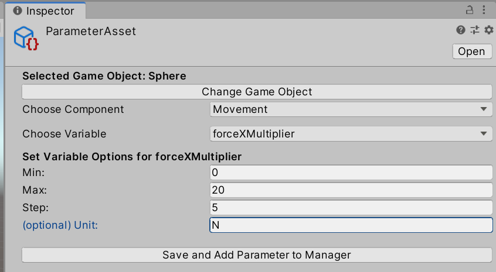

# Evaluation Framework

The [Evaluation Framework](https://github.com/siemens/evaluation-framework) is a set of open source software libraries and tools in [C\# ](https://docs.microsoft.com/de-de/dotnet/csharp/csharp), implemented in .[NET](https://www.microsoft.com/net), and [Python](https://www.python.org/) for efficiently evaluating simulation models of mechatronic systems, in particular by using the game engine [Unity](https://unity3d.com/) as simulation environment, and visualizing the evaluation results in an interactive GUI.

This project consists of 3 tools to evaluate many variants of (Unity) simulations and visualize the results. The tools can be used independently, or in a sequence.

---

## Tool 1: Define Variants and Targets in Unity

1. Include [EvaluationFrameworkUnity](https://github.com/siemens/evaluation-framework/tree/master/Unity3D/EvaluationFrameworkUnity) into the Asset folder of your Unity project.
2. Define the parameters you want to vary and the target values you want to evaluate.
3. Generate the resulting `.json` files and compile your Unity project as a standalone `.exe`.

 

Go [here](https://github.com/siemens/evaluation-framework/wiki/Evaluation-Space) for additional information on this specific tool.  
Have a look at the developer documentation for this tool [here](https://github.com/siemens/evaluation-framework/wiki/Unity-Editor-Functionality).

## Tool 2: Evaluate all Variants

Execute the C# console application [EvaluationFramework](https://github.com/siemens/evaluation-framework/tree/master/EvaluationFramework)
to evaluate all variants.

Go [here](https://github.com/siemens/evaluation-framework/wiki/Execution-and-Evaluation) for additional information on this specific tool.  
Have a look at the developer documentation for this tool [here](https://github.com/siemens/evaluation-framework/wiki/Execution-and-Evaluation-of-Simulations).

## Tool 3: Visualize the Results

Visualize the evaluation results in a special UI using the python application [VisualizationGUI](https://github.com/siemens/evaluation-framework/tree/master/VisualizationGUI).

Go [here](https://github.com/siemens/evaluation-framework/wiki/Point-Cloud-Visualization) for additional information on this specific tool.  
Have a look at the developer documentation for this tool [here](https://github.com/siemens/evaluation-framework/wiki/Visualization-of-Evaluation-Results).

## Contents ##

* [Unity3D](https://github.com/siemens/evaluation-framework/tree/master/Unity3D): Source code of the Evaluation Framework connected to the game engine [Unity](https://unity3d.com/) (**Tool 1**)
* [EvaluationFramework](https://github.com/siemens/evaluation-framework/tree/master/EvaluationFramework): .NET solution of the Evaluation Framework (**Tool 2**)
* [EvaluationFrameworkROS](https://github.com/siemens/evaluation-framework/tree/master/EvaluationFrameworkROS): .NET solution of the Evaluation Framework with the extension of communicating with a [ROS](https://www.ros.org/) system via [ROS\#](https://github.com/siemens/ros-sharp) (**Tool 2**)
* [VisualizationGUI](https://github.com/siemens/evaluation-framework/tree/master/VisualizationGUI): [Python](https://www.python.org/) code of the GUI visualizing the evaluation results (**Tool 3**)

[Here](https://github.com/siemens/evaluation-framework/wiki/Demonstration-Project) is an application example illustrating what can be done with the Evaluation Framework.

## Releases ##

Each release contains:
* `EvaluationFrameworkUnity.unitypackage`: Unity Package containing [EvaluationFrameworkUnity](https://github.com/siemens/evaluation-framework/tree/master/Unity3D/EvaluationFrameworkUnity) (**Tool 1**).
* `EvaluationFramework.zip`:
zipped binaries of [EvaluationFramework](https://github.com/siemens/evaluation-framework/tree/master/EvaluationFramework) (**Tool 2**)
* `VisualizationGUI.zip`: zip file containing the [VisualizationGUI](https://github.com/siemens/evaluation-framework/tree/master/VisualizationGUI) python application (**Tool 3**)

Please get the latest development version directly from the [tip of this master branch](https://github.com/siemens/evaluation-framework).

## Licensing ##

The [Evaluation Framework](https://github.com/siemens/evaluation-framework) is open source under the [Apache 2.0 license](http://www.apache.org/licenses/LICENSE-2.0) and is free for commercial use.

## Further Info ##

* [Contribution and Feedback](https://github.com/siemens/evaluation-framework/wiki/Contribution-and-Feedback)
* [Platform Support](https://github.com/siemens/evaluation-framework/wiki/Software-Information)
* [Software Version Requirements](https://github.com/siemens/evaluation-framework/wiki/Software-Information)
* [External Dependencies](https://github.com/siemens/evaluation-framework/wiki/Software-Information)
* [Contributors and Acknowledgements](https://github.com/siemens/evaluation-framework/wiki/Contributers-and-Acknowledgements)

### We are also curious to hear how you intend to use - or are already using - the Evaluation Framework. If you like, come tell us more about your project [here](https://github.com/siemens/evaluation-framework/issues/1). ###

For general information, please [read the Wiki](https://github.com/siemens/evaluation-framework/wiki).  
If you have any questions, feel free to [contact the Author](mailto:m.dyck@gmx.net).

---

© Siemens AG, 2020

Author: Michael Dyck (m.dyck@gmx.net)
